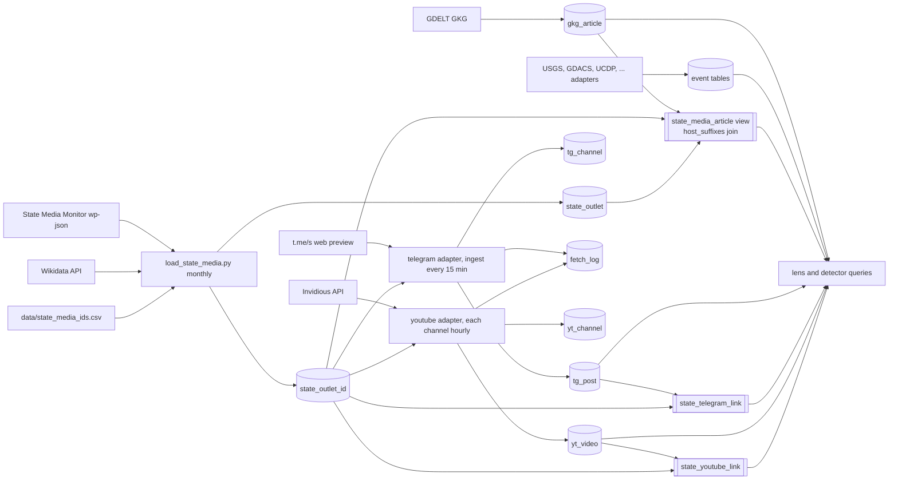

# Architecture

Updated to `specs/state-youtube.md` After. Earlier specs predate the
diagram policy; the adapters box stands for every source under
`newsradar/`.

```mermaid
flowchart LR
  GDELT[GDELT GKG] --> GKG[(gkg_article)]
  Other[USGS, GDACS, UCDP, ... adapters] --> Events[(event tables)]
  SMM[State Media Monitor wp-json] --> Loader[load_state_media.py monthly]
  WD[Wikidata API] --> Loader
  CSV[data/state_media_ids.csv] --> Loader
  Loader --> SO[(state_outlet)]
  Loader --> SOI[(state_outlet_id)]
  GKG --> SMA[[state_media_article view<br/>host_suffixes join]]
  SOI --> SMA
  SO --> SMA
  TG[t.me/s web preview] --> Coll[telegram adapter, ingest every 15 min]
  SOI --> Coll
  Coll --> TC[(tg_channel)]
  Coll --> TP[(tg_post)]
  Coll --> FL[(fetch_log)]
  TP --> STL[[state_telegram_link]]
  SOI --> STL
  INV[Invidious API] --> YColl[youtube adapter, each channel hourly]
  SOI --> YColl
  YColl --> YC[(yt_channel)]
  YColl --> YV[(yt_video)]
  YColl --> FL
  YV --> SYL[[state_youtube_link]]
  SOI --> SYL
  GKG --> Lens[lens and detector queries]
  Events --> Lens
  SMA --> Lens
  TP --> Lens
  STL --> Lens
  YV --> Lens
  SYL --> Lens
```
